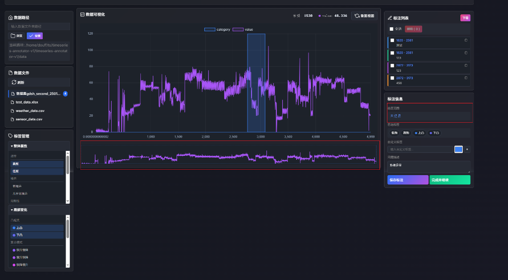
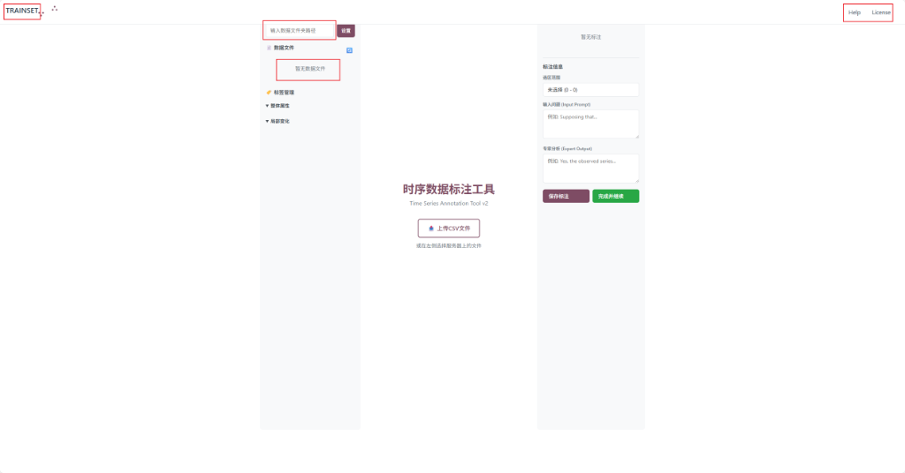

# 时序数据标注工具 v2

> 基于 timeseries-annotator-v1 后端 + TRAINSET 前端交互的整合项目

## 项目状态

🔴 **当前状态**: 存在多个问题，需要修复

## 快速开始

### 启动后端

```bash
cd backend
pip install -r requirements.txt
python app.py
```

后端将在 http://localhost:5000 启动

### 启动前端

```bash
cd frontend
npm install
npm run dev
```

前端将在 http://localhost:8080 启动

## 文档目录

| 文档 | 说明 |
|------|------|
| [功能列表](./docs/01-feature-list.md) | 完整功能清单，V1/V2/TRAINSET对比 |
| [问题清单](./docs/02-issues-list.md) | 当前问题及优先级排序 |
| [开发方案](./docs/03-development-plan.md) | 架构设计、界面设计、开发计划 |
| [API文档](./docs/04-api-reference.md) | 后端REST API接口文档 |

## 截图

### V1 界面（参考）


### V2 当前状态


## 目录结构

```
timeseries-annotator-v2/
├── backend/              # Flask后端
│   ├── app.py           # API入口
│   ├── config/          # 配置文件
│   ├── data/            # 数据文件
│   └── annotations/     # 标注存储
├── frontend/            # Vue.js前端
│   ├── src/
│   │   ├── views/       # 页面组件
│   │   └── components/  # 公共组件
│   └── package.json
└── docs/                # 文档目录
    ├── images/          # 截图
    └── *.md             # 文档文件
```

## 技术栈

- **前端**: Vue.js 2.x, D3.js, Chart.js
- **后端**: Flask, Pandas
- **存储**: JSON文件

## License

MIT
